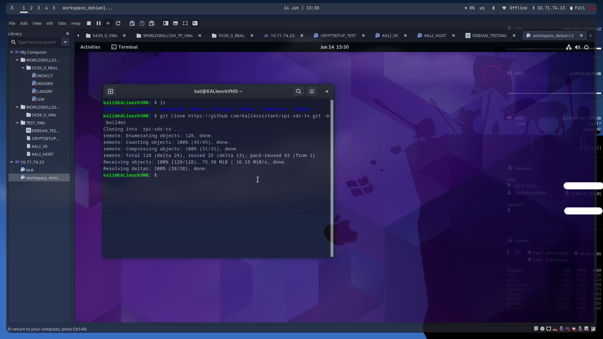
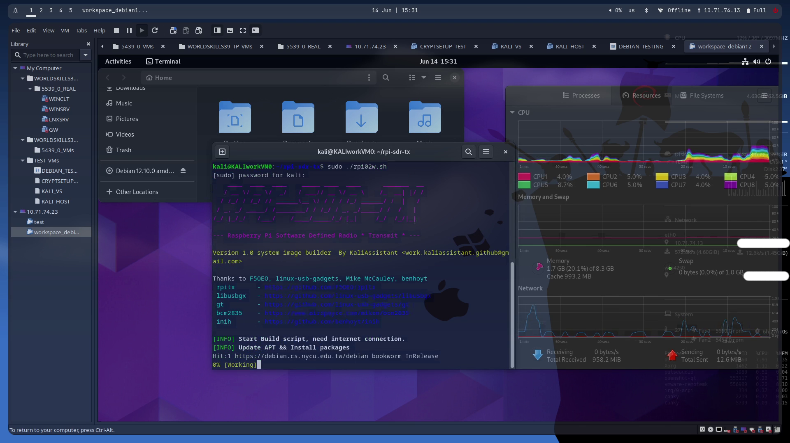
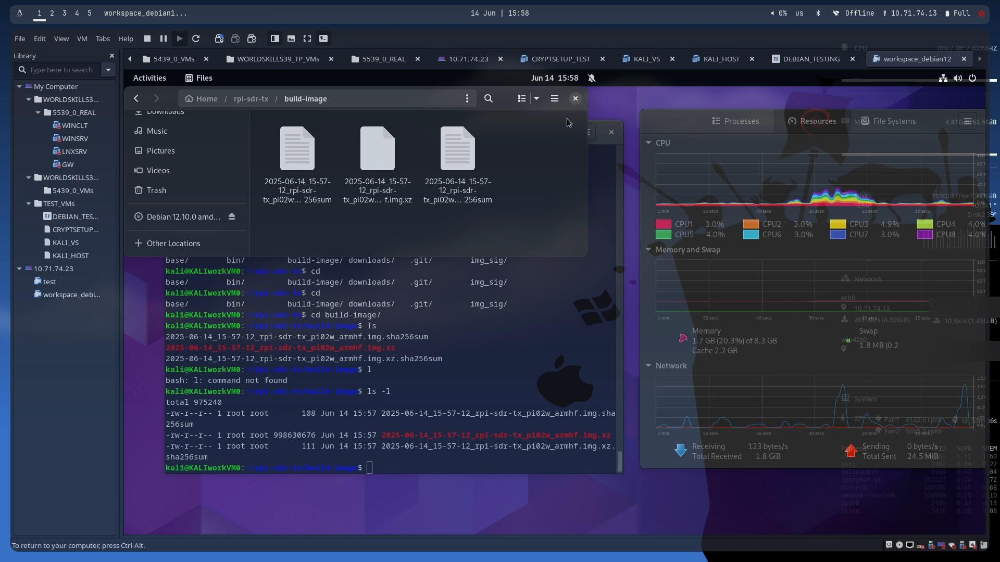
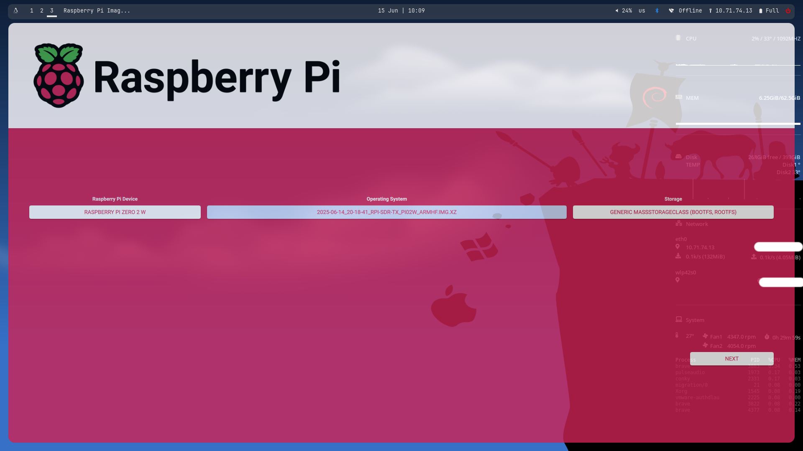
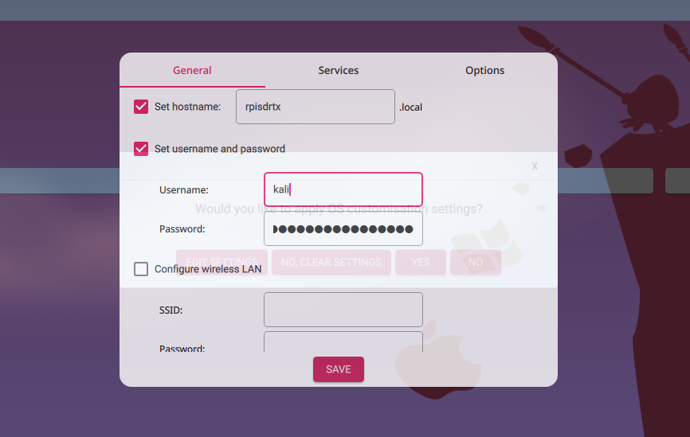
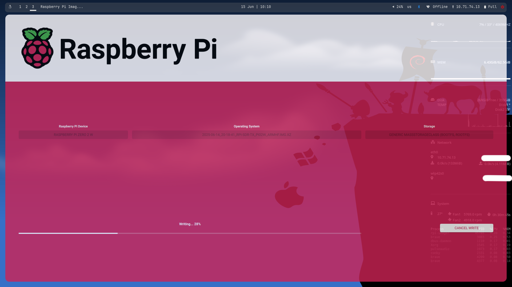

# rpi-sdr-tx
Raspberry Pi Software Defined Radio for Trasmit

## Assembly
- Raspberry pi zero 2w PCB
  
 

 

 

 

 

 

 

### Cirucit

### 3DP/PCB
- PETG BLACK (Recommend)

- usb-c female connector:
  - https://de.aliexpress.com/item/1005005262209302.html?gatewayAdapt=glo2deu
- m2 & m2.5 heat screw inserts
  - https://a.co/d/90MZVNr
- m2 & m2.5 Hex Socket Bolt Countersunk Flat Head Screws 
  - https://a.co/d/fhqFaUB
- ws2812b RGB led
  - https://a.co/d/iXdWQLz
- SMA female PCB side connector
  - https://a.co/d/1QsP954

## Install 
1. Burn Raspbian Bookworm Lite __armhf (32bit)__ to SD card, the rpitx only support 32 bit now. Remember Add your wifi connection config, we need ssh to pi after boot.

2. Run `sudo apt update && sudo apt -y full-upgrade` and reboot again.

3. Install git `sudo apt install git` and clone this repository `git clone https://github.com/KaliAssistant/rpi-sdr-tx.git`

4. cd to repository `cd rpi-sdr-tx` and run install script `./install.sh` .

5. If install script ask for anything, just enter `y` .

6. When installation completed, script will reboot device, you will see RNDIS ethernet on your NetworkManager. just add `172.16.48.254/24` with no gateway to your computer NetworkManager, and you can `ssh <user>@172.16.48.1` via RNDIS/USB-ETHERNET to your pi. Now you can run rpitx or anything else with your rpi-sdr-tx.

#### Install speedrun

https://github.com/user-attachments/assets/191871f1-86b6-43fb-9782-dcf97c5af731

## Build rpi-sdr-tx image
If you want self build your image file, you can switch to __builder__ branch.

1. Create a __debian / Ubuntu / kali (debian based)__ VM or Docker for build environment. I am using VMware.

2. Clone this repository builder branch `git clone https://github.com/Kaliassistant/rpi-sdr-tx.git -b builder`

3. cd to repository `cd rpi-sdr-tx` and run `./rpi02w.sh` as __root__ , script will auto update and download packages

4. Scripts may take up to ~1 hour to complete. ☕ Grab a coffee (or anything)

5. If build success, the build images and checksum all in the `./build-image/`

6. Use __rpi-imager (recommend)__ or __balenaEther__ to burn the build image. If you are using rpi-imager, you can change your username, password, wifi settings, ssh...etc.

7. RaspberryPi zero 2w first boot will auto resize SD card part2 and rootfs, so it will reboot again. If you have not add wifi settings, remember add `172.16.48.254` with no gateway (or self) to your computer NetworkManager, and than you can ssh to pi via USB RNDIS/ethernet.

