# rpi-sdr-tx

> Raspberry Pi Software-Defined Radio Transmitter Toolkit

## About rpi-sdr-tx

**rpi-sdr-tx** is a complete toolkit for turning your Raspberry Pi into a software-defined radio (SDR) transmitter. Based on **rpitx**, it enables RF signal transmission from 5 kHz to 1500 MHz without requiring additional RF hardware—though filtering is strongly recommended to avoid unwanted interference.

This project is intended for **educational and experimental use** in RF systems. It has **not been certified** for compliance with radio transmission regulations. **You are solely responsible** for ensuring your use complies with local laws.

This repository includes:

- ✅ **rpitx** SDR transmission software  
- 🧰 **USB gadget utilities**  
- 🔨 **Custom image build scripts**  
- 🧱 **3D-printable case designs**  
- 💿 Prebuilt images available in the [Releases](https://github.com/KaliAssistant/rpi-sdr-tx/releases)

## Hardware

<p align="center">
  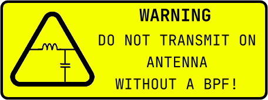
</p>

> ⚠️ **Warning**  
> Do **not** transmit RF signals through an antenna **without a Band-Pass Filter (BPF)**!  
> Unfiltered signals may cause **harmful interference** and violate regulatory limits.


---
### 📦 Parts List


| Name | Link | Image | Qty |
|------|------|-------|-----|
| **Raspberry Pi Zero 2 W** | [Amazon](https://a.co/d/3vd7qhf) | 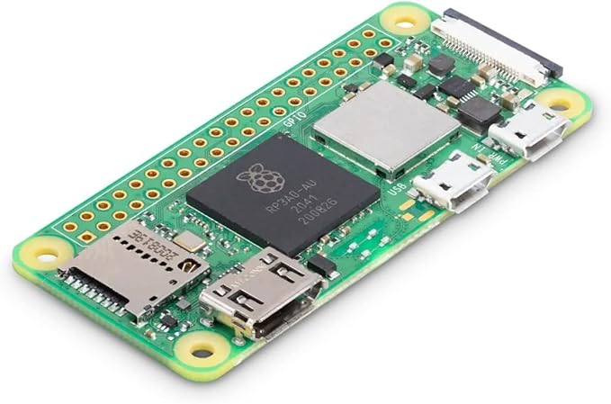 | 1 |
| **PCB Edge - Straight SMA Female Connector** | [Amazon](https://a.co/d/g4PZYQh) | 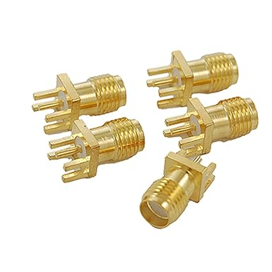 | 1 |
| **WS2812B SMD 5050 RGB NeoPixel** | [Amazon](https://a.co/d/crST7Zt) | 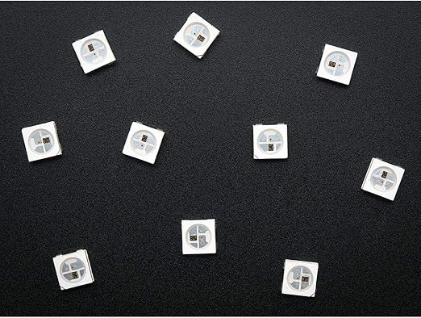 | 1 |
| **1x40-Pin 2.54mm Header** | [Amazon](https://a.co/d/6LbdygT) | 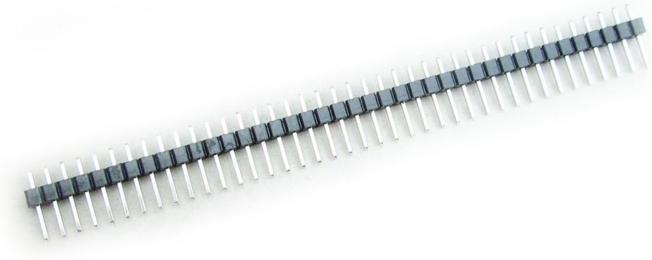 | 1 |
| **USB-C Female Connector (Panel Mount)** | [Amazon](https://a.co/d/6ryeTOC) *(See Note I)* | 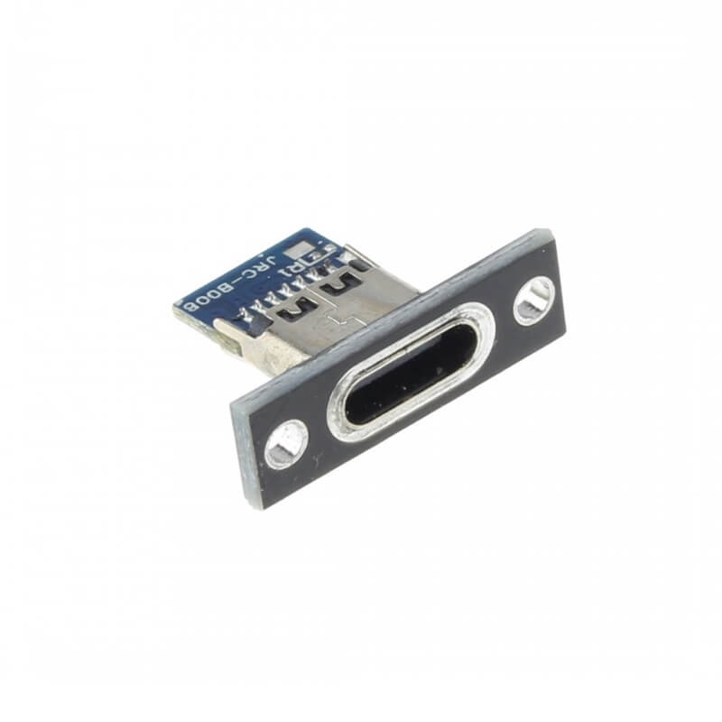 | 1 |
| **M2x0.4 Heat-Set Thread Insert** | [Amazon](https://a.co/d/6mJeA5C) *(See Note II)* | 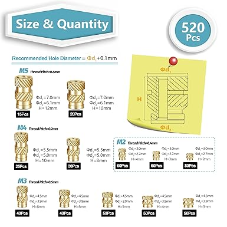 | - D3\*H2.5 (or D3\*H3) ×4<br>- D3\*H2 ×2 |
| **M2x0.4 Flat Head Screws (6mm)** | [Amazon](https://a.co/d/2hhKypX) | 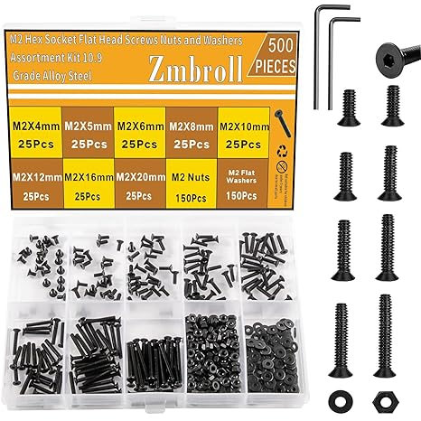 | 4 |
| **M2x0.4 Ultra-Low Head Torx Screws (5mm)** | [Amazon](https://a.co/d/fiHYJ7t) |  | 2 |
| **Aluminum Heat Sink (for Pi)** | [Amazon](https://a.co/d/bpbX8vX) | 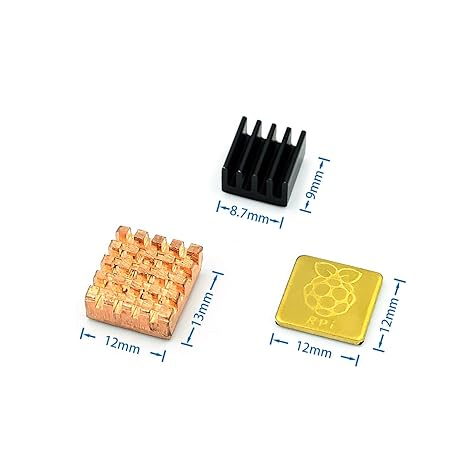 | 1 |
| **IPEX 1 SMT Connector** *(optional)* | [Amazon](https://a.co/d/4n84BrI) | 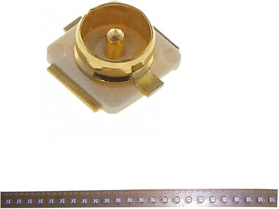 | 1 |
| **2.4G WiFi/BT FPC Antenna** *(optional)* | [Amazon](https://a.co/d/bWsmjda) | 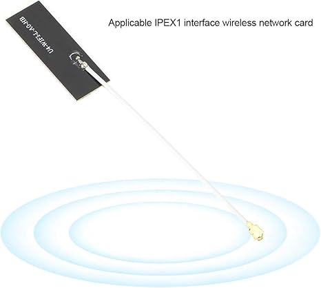 | 1 |


>#### 📝 Notes
>**Note I – USB-C PCB Panel Mount**  
>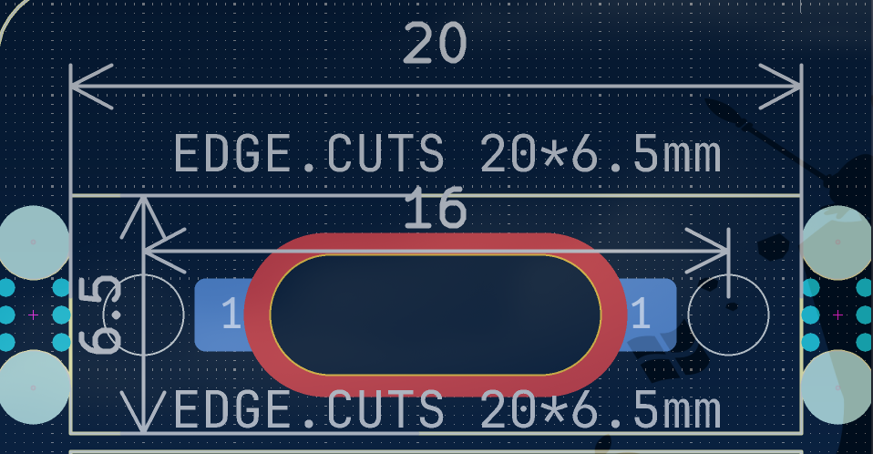
>The "panel mount" is actually a custom **FR-4 PCB** with a USB-C female port cutout. Most Amazon listings won't match the precise size (⌀16 mm between mounting holes).  
If you're lucky, you'll get a close match — otherwise, it's best to use the **Gerber files** provided in this repository. You can upload them to a PCB manufacturer like **JLCPCB** with the following settings:
>- Thickness: `1.6 mm`
>- Material: `FR-4`
>- Copper: `1oz`
>- Solder mask color: your choice
>
>Then, purchase a standard USB-C **female breakout board** and **solder it edge-mounted** to the PCB. This gives you a clean and sturdy "USB-C Female PCB Panel Mount."
>
>
>**Note II – Heat-Set Inserts for 3D-Printed Case**  
If you’re using the 3D-printed case STL files provided in this repository, **print them with FDM**, **not SLA**!  
SLA resin prints are **too brittle** for heat-set inserts and may crack or warp under pressure or heat.  
Use **FDM printers with standard PLA, PETG, or ABS** for reliable mechanical strength and heat resistance when inserting the M2 thread inserts.

### 🔧 Tools Required

| Tool | Image |
|------|-------|
| **Wire Wrapping Wire (~30AWG)** | <p align="center">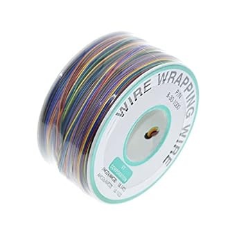</p> |
| **24 AWG Electrical Wire** | <p align="center">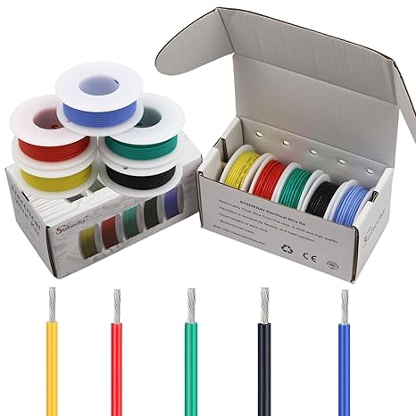</p> |
| **UV Solder Mask Ink** | <p align="center">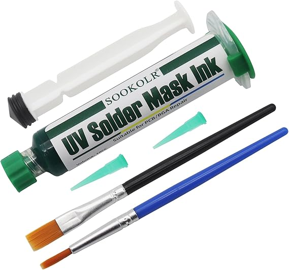</p> |
| **UV Flashlight** | <p align="center">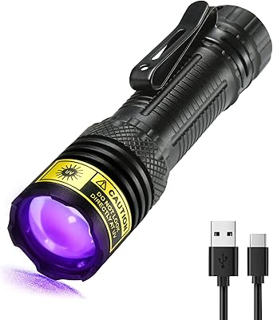</p> |
| **Soldering Tools** | - Solder<br>- Solder Paste<br>- Soldering Iron<br>- ESD Tweezers *(optional, for IPEX install)* |

---

### 🛠️ Assembly

**Video**  
A full step-by-step assembly video will be made when time permits.  
For now, here’s a preview of the completed assembly:

---

**SMA Connector**
<p align="center">
    
    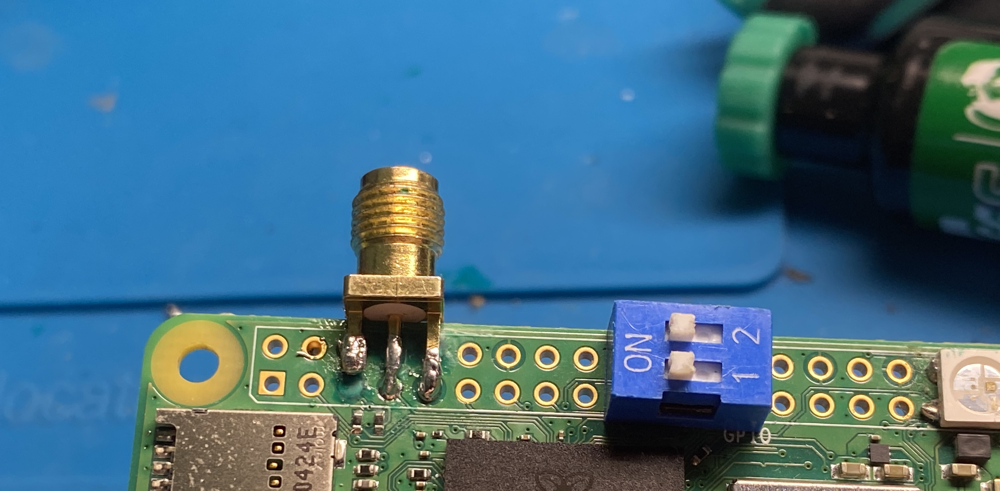
    

</p>

---

>**SMA Connector – Why Use UV Solder Mask Ink?**
><p align="center">
>    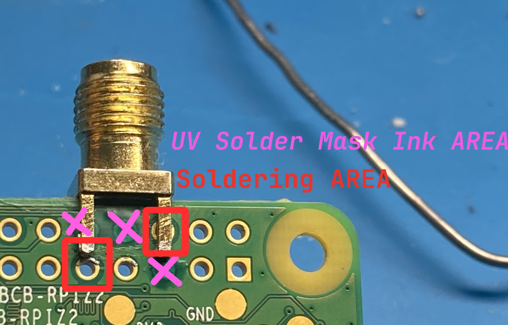
>    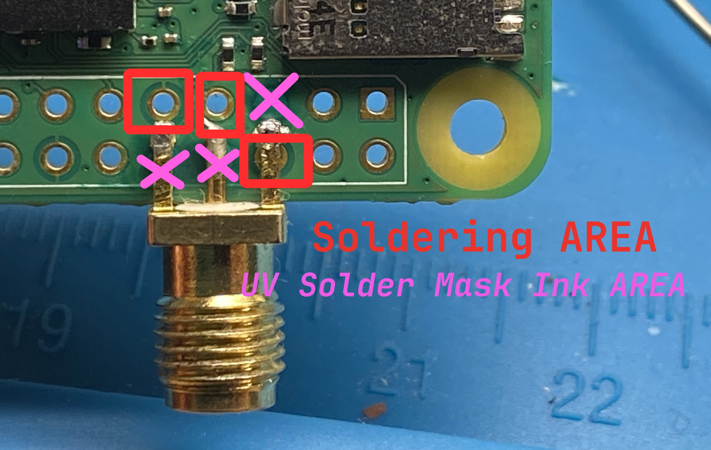
></p>
>
>The RF output of `rpi-sdr-tx` is transmitted through **GPIO4**.  
If you're soldering an SMA connector directly to the **edge of the Pi**, take note:
>
>- **GPIO4 is surrounded by 5V, 3.3V, and GND pins.**
>- Accidental bridging during soldering could damage the Pi.
>- Apply **UV solder mask ink** around these power pins to **insulate and protect** adjacent pads before soldering.
>
>This precaution ensures safe RF output without risking a short circuit.

---

**Case**

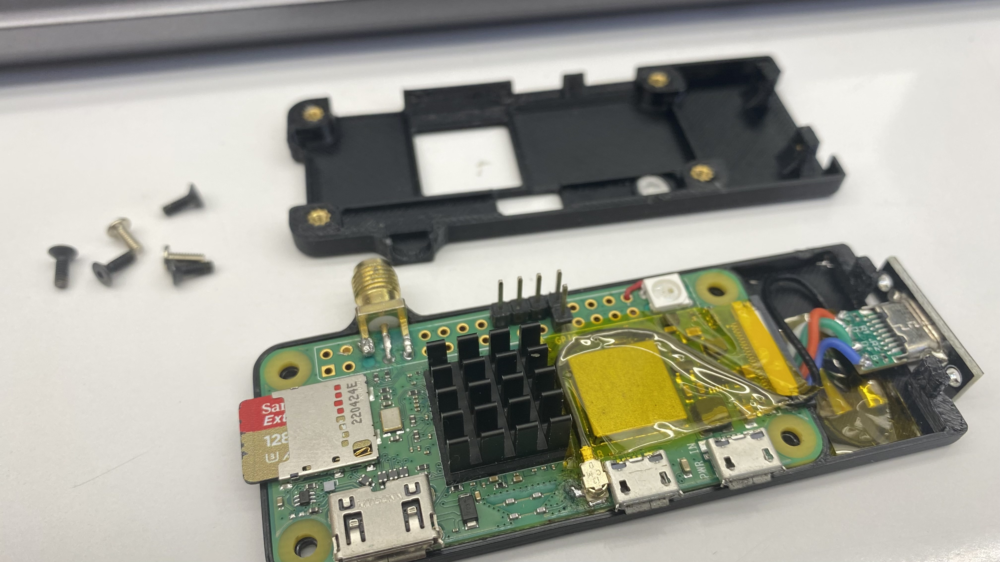

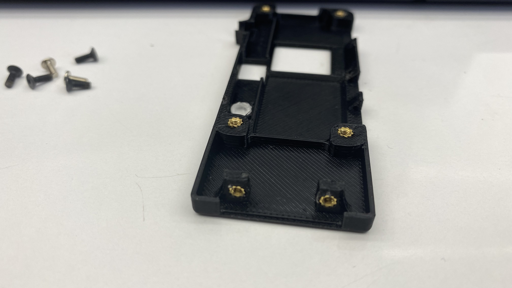 

 

### Cirucit
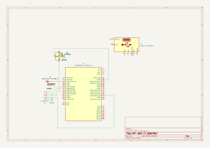

---

## 📥 Install

1. Flash **Raspberry Pi OS (Bookworm Lite, 32-bit armhf)** to your SD card.  
   > ⚠️ Only 32-bit is supported by `rpitx`.  
   Be sure to add your **Wi-Fi configuration** before first boot, as we will SSH into the Pi.

   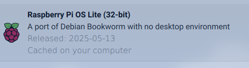

2. Run:
   ```bash
   sudo apt update && sudo apt -y full-upgrade
   sudo reboot
   ```

3. Install Git and clone this repo:
   ```bash
   sudo apt install git
   git clone https://github.com/KaliAssistant/rpi-sdr-tx.git
   ```

4. Enter the repository and run the installer:
   ```bash
   cd rpi-sdr-tx
   ./install.sh
   ```

5. The script modifies boot configs, so if prompted, **type `y`** to continue.

6. After installation, the Pi will reboot. You’ll see **RNDIS Ethernet** on your PC.  
   Add a static IP: `172.16.48.254/24` (no gateway) on your host system.

7. SSH into the Pi:
   ```bash
   ssh <user>@172.16.48.1
   ```

---

#### ⚡ Install Speedrun Demo  
https://github.com/user-attachments/assets/191871f1-86b6-43fb-9782-dcf97c5af731

---

## 💿 Build Your Own Image

Want to build the image yourself? Switch to the `builder` branch:

1. Create a **Debian/Ubuntu/Kali (Debian-based)** VM or Docker container.  
   > _(Tested with VMware)_

2. Clone the builder branch:
   ```bash
   git clone https://github.com/KaliAssistant/rpi-sdr-tx.git -b builder
   ```

   

3. Setup builder config:
   ```bash
   cd rpi-sdr-tx
   cp ./builder.txt.example ./builder.txt
   ```

   Edit `builder.txt` to set mirror URLs, USB serial ID, etc.

4. Run the build script as `root`:
   ```bash
   sudo ./rpi02w.sh
   ```

   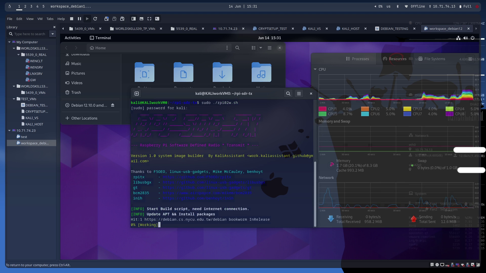

5. Build will take ~1 hour. ☕ Grab a coffee.

6. After success, check `./build-image/` for your image and checksum.

   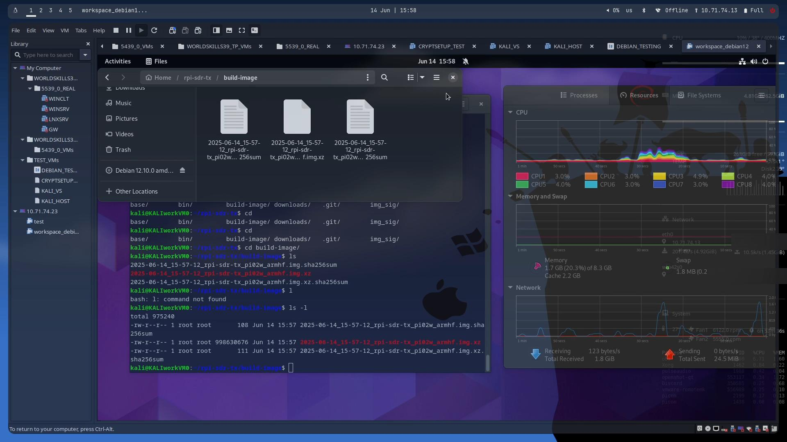

7. Flash the image using **Raspberry Pi Imager (recommended)** or **balenaEtcher**.  
   The Pi Imager allows you to set hostname, username, password, Wi-Fi, SSH, etc.

   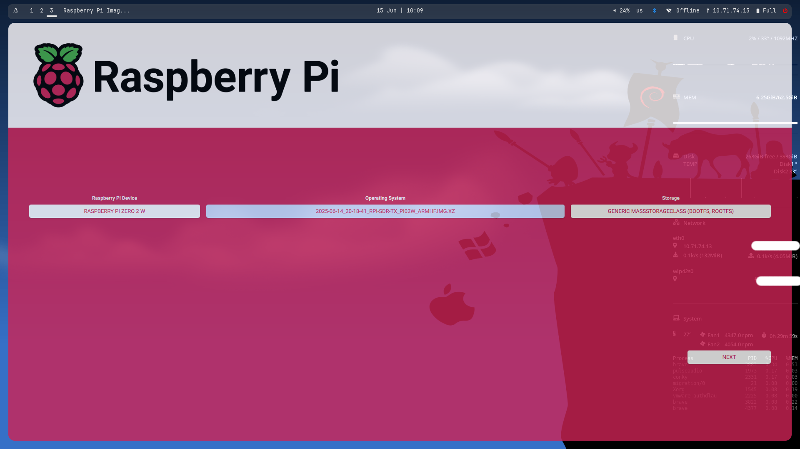  
     
   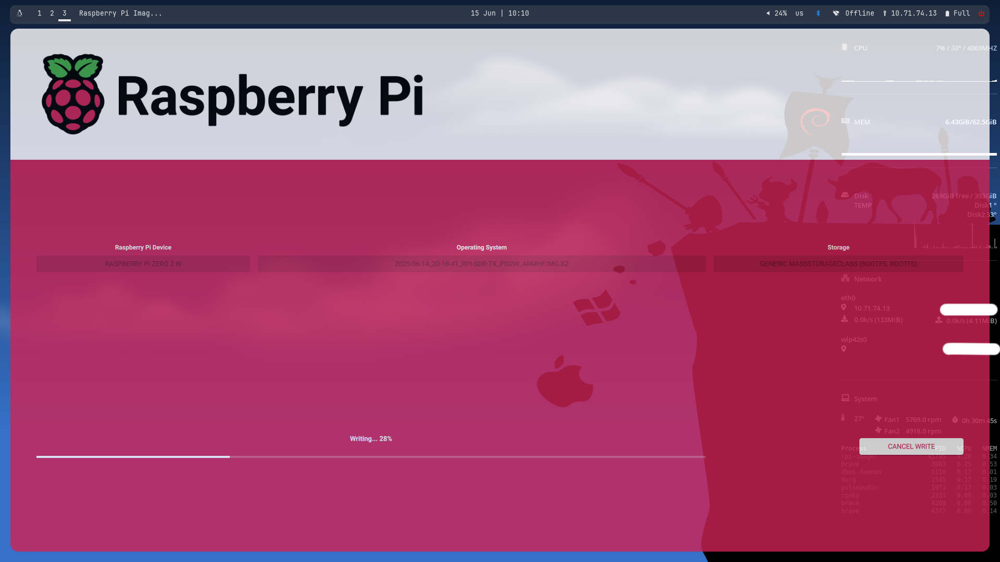

8. On first boot, the Pi Zero 2 W will auto-resize partition 2 and rootfs, then reboot.  
   If you didn’t set Wi-Fi, manually configure `172.16.48.254` (no gateway) on your host to SSH via RNDIS USB Ethernet.

---

#### ⚡ Build Speedrun Demo  
https://github.com/user-attachments/assets/0cf1e91f-3009-4e01-9d99-45d8bbc2cdbd

---

## 🔊 Audio Test

### rpi-sdr-tx Audio Files Test  
#### ▶️ [Watch Full Video on YouTube (Volume Warning)](https://www.youtube.com/watch?v=e7_sDhkGPY4)

[](https://www.youtube.com/watch?v=e7_sDhkGPY4)

Demo:  
https://github.com/user-attachments/assets/4219b572-6db6-4b58-8dff-92a529460f64

---
## 🙏 Credits

- [`rpitx`](https://github.com/F5OEO/rpitx) — RF transmitter core by [F5OEO](https://github.com/F5OEO)  
- [`libusbgx`](https://github.com/linux-usb-gadgets/libusbgx) — USB gadget helper  
- [`gt`](https://github.com/linux-usb-gadgets/gt) — USB gadget config tool  
- [`bcm2835-1.75`](http://www.airspayce.com/mikem/bcm2835/) — BCM2835 GPIO library by Mike McCauley (GPLv3)  
- [`inih`](https://github.com/benhoyt/inih) — INI parser by Ben Hoyt (New BSD License)

---

This repository is licensed under **GPLv3**  
© KaliAssistant `<work.kaliassistant.github@gmail.com>`

